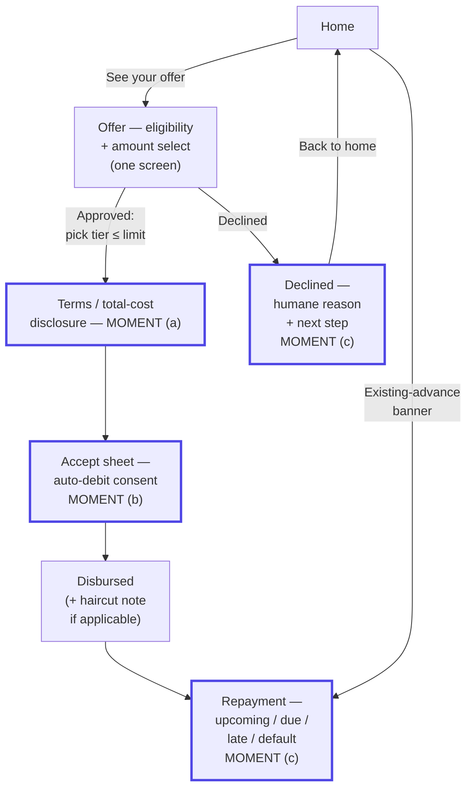

# Flow map, state inventory & copy deck — Gate 4

## Flow map

The heavier-outlined nodes are the three hard moments this whole doc is organized around (also named in their labels, so the emphasis isn't color-only): (a) terms/total-cost disclosure, (b) the accept decision, and (c) the not-good paths — declined, and the late/default repayment states. Notes on the edges: only tiers up to the offered limit are rendered at amount-select (nothing above it shown, even disabled); a decline is a dead end for *this application*, never for the user — "Back to home" always exists; and Home's existing-advance banner is a second, independent entry into Repayment for a user with an active advance.

## Why some spine screens don't exist

- **No separate "Amount select" screen.** Eligibility ("you're approved") and amount selection ("choose up to your limit") were originally two screens/taps for what is functionally one decision, and each screen separately explained "you may qualify" / "choose how much you need" — redundant framing copy for the same idea. Merged into one screen: the approval banner's single line now covers both facts, the tier chips render directly beneath it, and one "Continue" CTA (disabled until a tier is picked) replaces the old two-tap "Choose your amount" → "Continue" sequence. This is Hick's Law applied directly — fewer sequential decisions for one underlying choice — plus NN/g's minimalism heuristic (no restating information the user just read).
- **No separate "over-limit" screen.** Per Context Digest assumption #4, over-limit is prevented at input — tiers above the offered limit aren't rendered at all in the tier selector, not merely disabled — never a post-submit rejection. Building a dedicated over-limit *error* screen would mean the prevention failed — the right fix was to make submitting an invalid amount impossible, not to design a nice error for it. (An earlier version disabled+greyed-out the unavailable tiers instead of omitting them; that still left a choice on screen the user could never take, which is its own kind of distraction — see Hick's Law / NN/g minimalism.)
- **No separate "haircut" screen.** A haircut is a different set of numbers on the *same* Terms screen (Assumption #6) — it doesn't need its own destination, only a re-disclosure banner and recomputed breakdown. A dedicated screen would add a step for no benefit and would break the Von Restorff/Serial Position composition of the disclosure screen.
- **Declined and Offer are the same screen**, not sequential steps — a decline is a state of eligibility, not a place you arrive at *after* seeing an offer.

## State inventory

| Screen | Default | Loading | Empty | Success | Error / edge | Disabled |
|---|---|---|---|---|---|---|
| Home | Balance + CTA or existing-advance banner | — (static mock balance) | N/A (always has balance + activity) | — | — | — |
| Offer + amount select | Tier chips once approved | Skeleton (~650ms, simulates eligibility check) | N/A | Approved banner + tier chosen → Continue enabled | Declined banner (3 reasons) with real next step | Tiers above limit not rendered at all (+ inline limit caption); Continue disabled until a tier is chosen |
| Terms | Disclosure card | — | — | — | Haircut re-disclosure banner when disbursed < applied | — |
| Accept sheet | Unchecked consent | Button `loading` during simulated accept call (~900ms) | — | Closes → Disbursed | — | Accept button disabled until consent is checked; Not-now disabled mid-accept (can't cancel a request mid-flight) |
| Disbursed | Success banner + breakdown | — | — | — | Haircut reiterated in banner copy if applicable | — |
| Repayment | Status banner (upcoming/due/late/default/on-time) | — | — | on_time = settled state | late / default = sensitive states, factual tone, "Contact support" only surfaced for these two | — |

Edge cases explicitly designed for: offer with a haircut disclosed *before* accept (not after — a silent post-accept adjustment would be a dark pattern); a decline reason that offers no action (`credit_score`, `other`) vs. one that does (`income_unverified`); an accept that can't be cancelled once the async call has started (`Not now` disabled while `accepting`).

## Copy deck (representative strings, by hard moment)

**(a) Terms / total-cost disclosure**
- Headline: *"Total to repay — Rs 15,450 on 4 Aug"*
- Breakdown: *"Amount disbursed · Fee (3% of disbursed, once) · Total to repay"*
- Auto-debit note (InfoSnippet, one line — the late-payment detail lives in the "?" FAQ sheet): *"Auto-debits from your NovaPay balance on 4 Aug."*
- Haircut re-disclosure (one line, self-contained): *"We can offer Rs 9,000 instead of the Rs 15,000 you applied for, based on today's risk checks — no penalty either way."*

**(b) Accept decision**
- Recap: *"Rs 15,450 on 4 Aug — that's the full amount you'll owe, pulled automatically."*
- Consent: *"I understand Rs 15,450 will be automatically deducted from my NovaPay balance on 4 Aug."*
- Primary CTA: *"Accept advance"* / loading: *"Please wait…"*
- Secondary: *"Not now"*

**(c) Not-good paths**
- Declined (credit_score): *"We can't offer an advance right now. Based on your account history, we're not able to extend a salary advance today. This isn't permanent — we review eligibility again as your account activity changes, no reapplication needed."*
- Declined (income_unverified): *"We couldn't verify your income. We need a recent payslip or bank statement to confirm your salary before we can offer an advance."* → action: *"Verify income"*
- Declined (freelance → `other`): *"This advance isn't available for your account. NovaPay salary advances currently require a fixed salaried payday to repay against. Freelance and variable income aren't supported yet — we're exploring how to extend this responsibly."*
- Late: *"Rs 10,300 — 4 days late. Your balance was short on 10 Jul. Add funds any time and we'll retry automatically — no extra fee for a first retry."*
- Default: *"Rs 15,450 — 34 days late. This advance is significantly overdue. Reach NovaPay support to arrange repayment — we're here to help you get current, not to pile on."*

Every decline/late/default string names the real, concrete cause and a real next step; none reference internal enums (`credit_score`, `income_unverified`, `other`, `days_late`) directly to the user.

## Law/heuristic tags on key decisions

- Total + date dominant, appearing first (headline) and last (auto-debit note) → **Von Restorff + Serial Position** (`TermsDisclosureCard`).
- Principal/fee/total grouped in one Panel; the date/auto-debit fact set apart in its own InfoSnippet → **Law of Proximity / Common Region**.
- Three fixed tiers instead of a free-amount field → **Hick's Law** + **NN/g Error Prevention** (over-limit can't be requested).
- Cost broken into labeled rows instead of one number → **Miller's Law / cognitive chunking**.
- Explicit consent checkbox, unchecked by default → **Postel's Law** (strict about what the user commits to) + ethical floor (never bury auto-debit).
- Button `loading` state on Accept → **Doherty Threshold** (perceived response stays fast even though the "call" takes ~900ms).
- Calm amber (not alarm red) + named reason + real next step on decline → **Peak-End Rule** (the decline is an emotional end; it should preserve dignity) + **NN/g error recovery**.
- Three-step `ProgressStepper` (Amount → Review → Confirm) → **Goal-Gradient + Zeigarnik**, without manufactured urgency.
